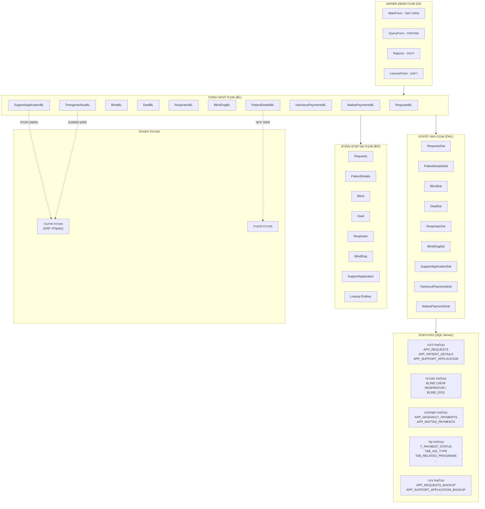
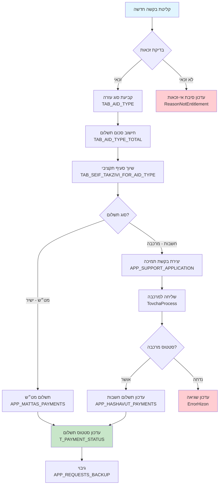
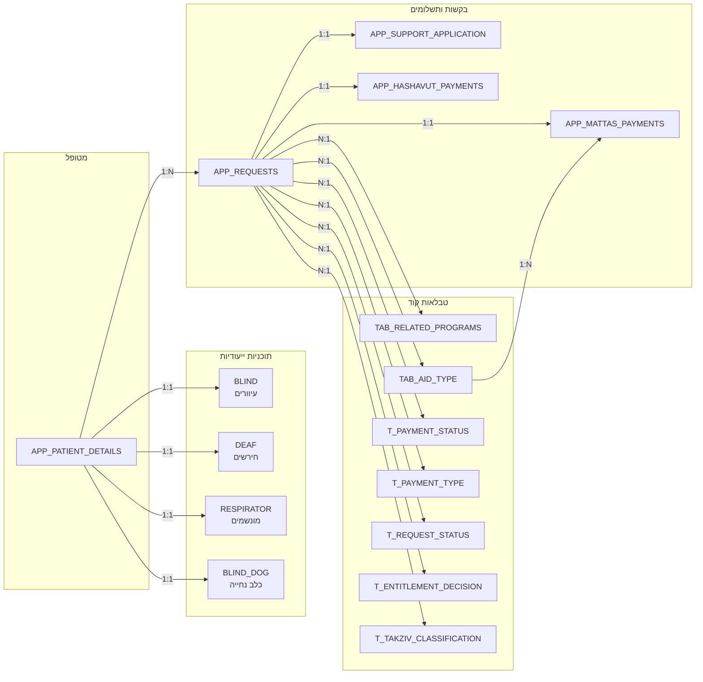

# PaymentsAid - Entity Relationship Diagram (ERD)

## סקירה כללית
מערכת PaymentsAid היא מערכת לניהול תשלומי סיוע לנכים ובעלי מוגבלויות (עיוורים, חירשים, מונשמים, כלב נחייה).
המערכת מנהלת בקשות, זכאויות, תשלומים וממשק מול מערכת מרכבה.

---

## דיאגרמת ERD (Mermaid)

```mermaid
erDiagram

    %% ===== CORE TABLES =====

    APP_PATIENT_DETAILS {
        int IDType_Num PK
        varchar PatientID_Num PK
        nvarchar BusinessArea PK
        int ProgramSymbol FK
        varchar PatientFirstName
        varchar PatientLastName
        int PatientGender_Num
        datetime PatientBirthDate
        nvarchar PatientAddress
        char PatientCitySymbol
        int PatientZipCod_Num
        int Authority_Num
        int PatientBank_Num
        int PatientBranch_Num
        varchar PatientBankAccount
        int Marganit_Num
        datetime PatientDetailsDateUpdate
        int PatientMerkavaStatus FK
        int PatientMerkavaStatusReason FK
        int PatientMerkavaNum
        nvarchar MerkavaPaymentModeNum
        int TovchaProcessId
        nvarchar ErrorHizon
    }

    APP_REQUESTS {
        int Request_Num PK "Identity"
        int IDType_Num
        varchar PatientID_Num
        int ProgramSymbol FK
        datetime EligibleDateAccompanying
        int RecognizedMinistryOfDefense
        int RecognizedMinistryOfNationalInsurance
        int EmployeeStatus
        int BeingInstitution
        int InstitutionType FK
        varchar InstitutionName
        int ResponsibleUnit
        int StayingAbroad
        int Deaf
        int EntitlementDecision_Num FK
        int ReasonNotEntitlement FK
        varchar MonthReport
        varchar MonthProcessing
        float TotalPayment
        int RequestStatus_Num FK
        int PaymentStatus_Num FK
        int PaymentType_Num FK
        varchar SeifTakzivi
        int TakzivClassific_Num FK
        int AidTypeSymbol FK
        int ApprovalType_Num FK
        nvarchar ApprovalPassword
        datetime RequestDateUpdate
        int EntitlementMedical_Num
        nchar Takana
        nchar FundsCenter
    }

    APP_SUPPORT_APPLICATION {
        int SupportApplicationId PK "Identity"
        int IDType_Num
        varchar PatintId_Num
        nvarchar PatientMerkavaNum
        int ProgramSymbol FK
        int SupportApplicationYear
        nvarchar ApplicationRecNum
        nvarchar ReferenceNumber
        nvarchar Takana
        nvarchar FundCenter
        nvarchar ApplicationNum
        nvarchar ApplicationTotalExpense
        decimal NewApplicationTotalExpense
        nvarchar ErrorFiledDesc
        nvarchar ErrorDesc
        nvarchar ApplicationUpdateMonthProcessing
        int ApplicationMerkavaStatusHizun FK
        nvarchar ApplicationMerkavaStatusDescCu
        nvarchar ApplicationMerkavaStatusNumCu
        int TovchaProcessId
        nvarchar MerkavaVoucher
        nvarchar GeneralInformation
    }

    %% ===== PROGRAM-SPECIFIC TABLES =====

    BLIND {
        int IDType_Num PK
        varchar PatientID_Num PK
        varchar PatientFirstName
        varchar PatientLastName
        int PatientGender_Num
        datetime PatientBirthDate
        nvarchar PatientAddress
        char PatientCitySymbol
        int PatientZipCod_Num
        int Authority_Num
        int PatientBank_Num
        int PatientBranch_Num
        varchar PatientBankAccount
        int Marganit_Num
        datetime DateStartWorking
        datetime DateEndWorking
        int EntitlementDecision FK
        datetime EligibleDateAccompanying
        int EntitlementMedical
        datetime EntitlementMedicalDate
        datetime DeathDate
    }

    BLIND_DOG {
        int IDType_Num PK
        varchar PatientID_Num PK
        varchar PatientFirstName
        varchar PatientLastName
        int PatientGender_Num
        datetime PatientBirthDate
        int EntitlementDecision FK
        datetime EligibleDateAccompanying
        int DogsFinalApprovalId
        datetime PaymentlApprovalDate
        int PaymentFinalApprovalId
        datetime DeathDate
    }

    DEAF {
        int IDType_Num PK
        varchar PatientID_Num PK
        varchar PatientFirstName
        varchar PatientLastName
        int PatientGender_Num
        datetime PatientBirthDate
        nvarchar PatientAddress
        char PatientCitySymbol
        int PatientZipCod_Num
        int Authority_Num
        int PatientBank_Num
        int PatientBranch_Num
        varchar PatientBankAccount
        int Marganit_Num
        int EmployeeStatus
        int EntitlementDecision FK
        datetime EligibleDateAccompanying
        datetime StartDateRight
        datetime DateStartWorking
        datetime DateEndWorking
        int Blind
    }

    RESPIRATOR {
        int IDType_Num PK
        varchar PatientID_Num PK
        varchar PatientFirstName
        varchar PatientLastName
        int PatientGender_Num
        datetime PatientBirthDate
        nvarchar PatientAddress
        char PatientCitySymbol
        int PatientZipCod_Num
        int PatientBank_Num
        int PatientBranch_Num
        int PatientBankAccount
        int Marganit_Num
        bit IsTracheostomy
        bit IsBTLEntitled
        bit ForeignWorkerPermit
        datetime DateOfDeath
        smallint BankAccountOwner FK
        varchar PaymentReceiveID
        int PaymentReceiveIDType
        int PaymentReceiveRelation
    }

    %% ===== PAYMENT TABLES =====

    APP_HASHAVUT_PAYMENTS {
        int IDType_Num PK
        varchar PatientID_Num PK
        int ProgramSymbol PK
        varchar MonthProcessing PK
        varchar SeifTakzivi
        float SchumNeto
        float SchumShotef
        float SchumRetro
        varchar Takana
        varchar FundCenter
        nvarchar PaymentReqRecNum
        char ApplicationNum
        nvarchar PaymentReqNum
        char Reference
        date ReferenceDate
        int TovchaProcessId
        int PaymentReqMerkavaStatusHizon FK
        nvarchar MerkavaErrorDesc
    }

    APP_MATTAS_PAYMENTS {
        int IDType_Num PK
        varchar PatientID_Num PK
        int ProgramSymbol PK
        varchar MonthProcessing PK
        float TotalPayment
        nvarchar QualityNeed
        int AidTypeSymbol FK
        int TakzivClassific_Num FK
    }

    %% ===== LOOKUP TABLES =====

    TAB_RELATED_PROGRAMS {
        int ProgramSymbol PK
        varchar ProgramName
        varchar CodMhitsa
        varchar GroupPayment
    }

    TAB_AID_TYPE {
        int AidTypeSymbol PK
        nvarchar AidTypeDesc
        datetime AidTypeDateUpdate
        int AidTypeMattas
    }

    TAB_AID_TYPE_TOTAL {
        int AidTypeSymbol PK_FK
        datetime AidTypeStartDate PK
        double AidTypeTotalSum
        datetime AidTypeEndDate
    }

    TAB_SEIF_TAKZIVI_FOR_AID_TYPE {
        varchar SeifTakzivi PK
        int TakzivClassific_Num PK_FK
        int AidTypeSymbol PK_FK
        nchar Takana
        nchar FundCenter
    }

    TAB_MONTHS_PROCESS {
        int ProgramSymbol PK_FK
        varchar MonthProcessing PK
        datetime MonthDateUpdate
    }

    T_PAYMENT_STATUS {
        int PaymentStatusNum PK
        varchar PaymentStatusDescr
    }

    T_PAYMENT_TYPE {
        int PaymentTypeNum PK
        varchar PaymentTypeDescr
    }

    T_REQUEST_STATUS {
        int RequestStatusNum PK
        varchar RequestStatusDescr
    }

    T_ENTITLEMENT_DECISION {
        int EntitlementDecisionNum PK
        varchar EntitlementDecisionDescr
    }

    T_APPROVAL_TYPE {
        int ApprovalTypeNum PK
        varchar ApprovalTypeDescr
    }

    T_ACTION_STATUS {
        int ActionStatusNum PK
        varchar ActionStatusDescr
    }

    T_TAKZIV_CLASSIFICATION {
        int TakzivClassificNum PK
        varchar TakzivClassificDescr
    }

    T_INSTITUTION_TYPE {
        smallint Intitution_Num PK
        varchar Intitution_Descr
    }

    T_BANK_ACCOUNT_OWNER {
        int BankAccountOwnerID PK
        varchar BankAccountOwnerDesc
    }

    T_ELIGIBLE {
        int ELIGIBLE_NUM PK
        varchar ELIGIBLE_Desc
    }

    T_PatientMerkavaStatus {
        int PatientMerkavaStatusNum PK
        nvarchar PatientMerkavaStatusDesc
    }

    T_PatientMerkavaStatusReason {
        int PatientMerkavaStatusReasonNum PK
        nvarchar PatientMerkavaStatusReasonDesc
    }

    T_PaymentReqMerkavastatusHizon {
        int PaymentReqMerkavaStatusHizonNum PK
        char PaymentReqMerkavaStatusHizonDesc
    }

    T_MESSAGE_TYPE {
        int MessageTypeNum PK
        varchar MessageTypeDescr
    }

    %% ===== COMMUNICATION TABLES =====

    APP_MAILS {
        int MailNum PK
        nvarchar MailTo
        nvarchar MailFrom
        nvarchar MailSubject
        nvarchar MailBody
        int MailIsSend
        datetime MailReceivingDate
        datetime MailSendDate
    }

    APP_MAILS_ATTACHMENTS {
        int MailNum FK
        varbinary AttachmentFile
        nvarchar FileName
    }

    %% ===== CONTROL & MONITORING =====

    APP_GET_REQUESTS_CONTROL {
        datetime ActionDate PK
        int ProgramSymbol PK_FK
        varchar MonthProcessing PK
        int ActionStatus_Num PK_FK
        int MessageControl_Num
        int MessageType_Num FK
        datetime MessageDate
        varchar MessageToEmail
    }

    APP_TIMING_INTERFACE {
        int TimingInterfaceId PK
        varchar TimingInterfaceDesc
        int SendSystemCode
        int ReceiveSystemCode
        int InterfaceCode
        datetime CreateDate
        datetime UpdateDate
        int TimingId
        int TimingValue
        datetime FromDate
        datetime ToDate
        bit InProcess
        datetime NextRunDate
    }

    %% ===== USER MANAGEMENT =====

    APP_USERS {
        int UserId PK
        varchar IdentityId
        varchar UserName
        varchar FirstName
        varchar LastName
        int RoleId
        varchar Description
    }

    %% ===== DOCUMENTS =====

    APP_BENEFICIARY_DOCUMENTS {
        int DocTypeID
        datetime ValidForm
        datetime ValidTo
    }

    %% ===== BACKUP TABLES =====

    APP_REQUESTS_BACKUP {
        int Request_Num_backup PK "Identity"
        int Request_Num
    }

    APP_SUPPORT_APPLICATION_BACKUP {
        int SupportApplicationBackupId PK "Identity"
        int SupportApplicationId
    }

    %% ========== RELATIONSHIPS ==========

    %% Patient -> Programs
    APP_PATIENT_DETAILS ||--o{ APP_REQUESTS : "patient has requests"
    APP_PATIENT_DETAILS }o--|| TAB_RELATED_PROGRAMS : "belongs to program"
    APP_PATIENT_DETAILS }o--|| T_PatientMerkavaStatus : "has merkava status"
    APP_PATIENT_DETAILS }o--|| T_PatientMerkavaStatusReason : "has status reason"

    %% Requests -> Lookups
    APP_REQUESTS }o--|| T_PAYMENT_STATUS : "has payment status"
    APP_REQUESTS }o--|| T_PAYMENT_TYPE : "has payment type"
    APP_REQUESTS }o--|| T_REQUEST_STATUS : "has request status"
    APP_REQUESTS }o--|| T_ENTITLEMENT_DECISION : "has entitlement decision"
    APP_REQUESTS }o--|| T_APPROVAL_TYPE : "has approval type"
    APP_REQUESTS }o--|| TAB_AID_TYPE : "has aid type"
    APP_REQUESTS }o--|| T_TAKZIV_CLASSIFICATION : "has budget classification"
    APP_REQUESTS }o--|| T_INSTITUTION_TYPE : "has institution type"
    APP_REQUESTS }o--|| TAB_RELATED_PROGRAMS : "belongs to program"

    %% Support Application
    APP_SUPPORT_APPLICATION }o--|| TAB_RELATED_PROGRAMS : "belongs to program"
    APP_SUPPORT_APPLICATION }o--|| T_PaymentReqMerkavastatusHizon : "has merkava status"

    %% Payments
    APP_HASHAVUT_PAYMENTS }o--|| TAB_RELATED_PROGRAMS : "belongs to program"
    APP_HASHAVUT_PAYMENTS }o--|| T_PaymentReqMerkavastatusHizon : "has merkava status"
    APP_MATTAS_PAYMENTS }o--|| TAB_RELATED_PROGRAMS : "belongs to program"
    APP_MATTAS_PAYMENTS }o--|| TAB_AID_TYPE : "has aid type"
    APP_MATTAS_PAYMENTS }o--|| T_TAKZIV_CLASSIFICATION : "has budget classification"

    %% Aid Type relationships
    TAB_AID_TYPE ||--o{ TAB_AID_TYPE_TOTAL : "has amount periods"
    TAB_AID_TYPE ||--o{ TAB_SEIF_TAKZIVI_FOR_AID_TYPE : "has budget items"
    T_TAKZIV_CLASSIFICATION ||--o{ TAB_SEIF_TAKZIVI_FOR_AID_TYPE : "classified by"

    %% Program-specific tables -> Entitlement
    BLIND }o--|| T_ENTITLEMENT_DECISION : "has entitlement"
    BLIND_DOG }o--|| T_ENTITLEMENT_DECISION : "has entitlement"
    DEAF }o--|| T_ENTITLEMENT_DECISION : "has entitlement"
    RESPIRATOR }o--|| T_BANK_ACCOUNT_OWNER : "has account owner type"

    %% Months Process
    TAB_MONTHS_PROCESS }o--|| TAB_RELATED_PROGRAMS : "belongs to program"

    %% Control
    APP_GET_REQUESTS_CONTROL }o--|| T_ACTION_STATUS : "has action status"
    APP_GET_REQUESTS_CONTROL }o--|| T_MESSAGE_TYPE : "has message type"
    APP_GET_REQUESTS_CONTROL }o--|| TAB_RELATED_PROGRAMS : "belongs to program"

    %% Mails
    APP_MAILS ||--o{ APP_MAILS_ATTACHMENTS : "has attachments"

    %% Backup references
    APP_REQUESTS_BACKUP }o--|| APP_REQUESTS : "backup of"
    APP_SUPPORT_APPLICATION_BACKUP }o--|| APP_SUPPORT_APPLICATION : "backup of"
```

---

## תיאור הטבלאות לפי קטגוריה

### טבלאות ליבה (Core)

| טבלה | תיאור | מפתח ראשי |
|-------|--------|------------|
| APP_PATIENT_DETAILS | פרטי מטופל/מוטב | IDType_Num + PatientID_Num + BusinessArea |
| APP_REQUESTS | בקשות תשלום | Request_Num (Identity) |
| APP_SUPPORT_APPLICATION | בקשות תמיכה למרכבה | SupportApplicationId (Identity) |

### טבלאות תוכניות ייעודיות (Program-Specific)

| טבלה | תיאור | מפתח ראשי |
|-------|--------|------------|
| BLIND | מוטבים עיוורים | IDType_Num + PatientID_Num |
| BLIND_DOG | מוטבים עם כלב נחייה | IDType_Num + PatientID_Num |
| DEAF | מוטבים חירשים | IDType_Num + PatientID_Num |
| RESPIRATOR | מוטבים מונשמים | IDType_Num + PatientID_Num |

### טבלאות תשלומים (Payments)

| טבלה | תיאור | מפתח ראשי |
|-------|--------|------------|
| APP_HASHAVUT_PAYMENTS | תשלומי חשבות (מרכבה) | IDType + PatientID + Program + Month |
| APP_MATTAS_PAYMENTS | תשלומי מט"ש (ישירים) | IDType + PatientID + Program + Month |

### טבלאות קוד (Lookup/Reference)

| טבלה | תיאור |
|-------|--------|
| TAB_RELATED_PROGRAMS | מערכות ייעודיות (עיוורים=1, חירשים=2, מונשמים=3, כלב נחייה=4) |
| TAB_AID_TYPE | סוגי עזרה |
| TAB_AID_TYPE_TOTAL | סכומי סוגי עזרה לפי תקופה |
| TAB_SEIF_TAKZIVI_FOR_AID_TYPE | סעיף תקציבי לסוג עזרה |
| TAB_MONTHS_PROCESS | חודשי עיבוד לכל תוכנית |
| T_PAYMENT_STATUS | סטטוס תשלום |
| T_PAYMENT_TYPE | סוג תשלום |
| T_REQUEST_STATUS | סטטוס בקשה |
| T_ENTITLEMENT_DECISION | החלטת זכאות |
| T_APPROVAL_TYPE | סוג אישור |
| T_ACTION_STATUS | סטטוס פעולה |
| T_TAKZIV_CLASSIFICATION | סיווג תקציבי |
| T_INSTITUTION_TYPE | סוג מוסד |
| T_BANK_ACCOUNT_OWNER | בעלות חשבון בנק |
| T_ELIGIBLE | זכאות |
| T_PatientMerkavaStatus | סטטוס מטופל במרכבה |
| T_PatientMerkavaStatusReason | סיבת סטטוס מרכבה |
| T_PaymentReqMerkavastatusHizon | סטטוס חיזון בקשת תשלום |
| T_MESSAGE_TYPE | סוג הודעה |

### טבלאות תקשורת (Communication)

| טבלה | תיאור |
|-------|--------|
| APP_MAILS | הודעות דוא"ל |
| APP_MAILS_ATTACHMENTS | קבצים מצורפים לדוא"ל |

### טבלאות בקרה ותזמון (Control & Timing)

| טבלה | תיאור |
|-------|--------|
| APP_GET_REQUESTS_CONTROL | בקרת עיבוד בקשות |
| APP_TIMING_INTERFACE | תזמון ממשקים (מרכבה) |

### טבלאות משתמשים ומסמכים

| טבלה | תיאור |
|-------|--------|
| APP_USERS | משתמשי המערכת |
| APP_BENEFICIARY_DOCUMENTS | מסמכי מוטבים |

### טבלאות גיבוי (Backup)

| טבלה | תיאור |
|-------|--------|
| APP_REQUESTS_BACKUP | גיבוי בקשות |
| APP_SUPPORT_APPLICATION_BACKUP | גיבוי בקשות תמיכה |

---

## קשרים עיקריים (Key Relationships)

1. **מטופל ← בקשות**: כל מטופל (APP_PATIENT_DETAILS) יכול להיות קשור למספר בקשות (APP_REQUESTS)
2. **בקשה ← תוכנית**: כל בקשה שייכת לתוכנית ייעודית (TAB_RELATED_PROGRAMS)
3. **בקשה ← סוג עזרה**: כל בקשה מקושרת לסוג עזרה (TAB_AID_TYPE) שקובע את הסכום
4. **סוג עזרה ← סכומים**: לכל סוג עזרה יש סכומים לפי תקופות (TAB_AID_TYPE_TOTAL)
5. **סוג עזרה ← סעיף תקציבי**: מיפוי בין סוג עזרה לסעיף תקציבי (TAB_SEIF_TAKZIVI_FOR_AID_TYPE)
6. **תשלומי חשבות**: APP_HASHAVUT_PAYMENTS מייצג תשלומים דרך מערכת מרכבה
7. **תשלומי מט"ש**: APP_MATTAS_PAYMENTS מייצג תשלומים ישירים
8. **טבלאות תוכנית**: BLIND, DEAF, RESPIRATOR, BLIND_DOG - כל אחת מנהלת נתונים ספציפיים לתוכנית

---

## זרימת נתונים עיקרית

```
מטופל (APP_PATIENT_DETAILS)
    │
    ├── בקשה (APP_REQUESTS)
    │       │
    │       ├── סוג עזרה (TAB_AID_TYPE) → סכום (TAB_AID_TYPE_TOTAL)
    │       ├── סטטוס בקשה (T_REQUEST_STATUS)
    │       ├── סטטוס תשלום (T_PAYMENT_STATUS)
    │       └── סוג תשלום (T_PAYMENT_TYPE)
    │
    ├── בקשת תמיכה למרכבה (APP_SUPPORT_APPLICATION)
    │
    ├── תשלום חשבות (APP_HASHAVUT_PAYMENTS)
    │
    └── תשלום מט"ש (APP_MATTAS_PAYMENTS)
```


---

## תרשים ארכיטקטורת המערכת (System Architecture)



---

## תרשים תהליך עיבוד תשלום (Payment Processing Flow)



---

## תרשים קשרי מפתחות (Key Relationships Summary)


