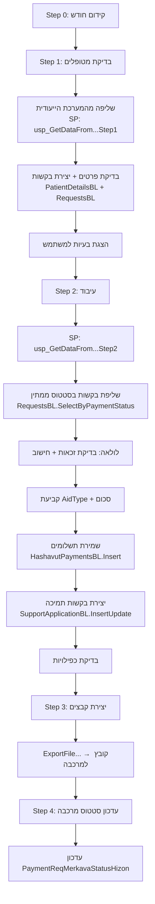

# PaymentsAid - זרימת קוד העיבוד החודשי

## ארכיטקטורה כללית

```
UI (RequestForm.cs) → BL (Business Logic) → DAL (TableAdapters) → DB (Stored Procedures)
```

כל שכבה יורשת מהשכבה שמתחתיה: `BL : BO`, `BO : BaseEntity`.
הגישה ל-DB מתבצעת דרך Typed DataSets + TableAdapters שקוראים ל-Stored Procedures.

---

## שלבי העיבוד (RequestForm.cs)

העיבוד מתבצע ב-4 שלבים סדרתיים, כל שלב נרשם בטבלת `APP_GET_REQUESTS_CONTROL`:

### Step 0 - קידום חודש עיבוד
```
MonthsProcessBL.UpdateMonthsProcess() → usp_TAB_MONTHS_PROCESS_Update
```
מקדם את חודש העיבוד ב-1 לתוכנית הפעילה.

### Step 1 - בדיקת מטופלים (CheckPatient)

לכל תוכנית נקראת פונקציה ייעודית:

| תוכנית | פונקציה | SP בדיקה | SP שליפה |
|---------|---------|----------|----------|
| עיוורים | `CheckPationtForBlind()` | `usp_CheckBlindData` | `usp_GetDataFromBlindSystemStep1` |
| מונשמים | `CheckPationtForRespirator()` | `usp_CheckRespiratorData` | `usp_GetDataFromRespiratorSystemStep1` |
| חירשים | `CheckPationtForDeaf()` | `usp_CheckDeafData` | `usp_GetDataFromDeafSystemStep1` |
| כלב נחייה | `CheckPationtForDogs()` | `usp_CheckBlindData` | `usp_GetDataFromDogsBlindSystemForIbudStep1` |

זרימה:
1. הרצת SP בדיקת תקינות נתונים
2. שליפת רשימת מוטבים מהמערכת הייעודית
3. לכל מוטב - בדיקת פרטים אישיים (`PatientDetailsBL.SelectByPatientDetails`)
4. יצירת/עדכון בקשה (`RequestsBL.InsertUpdateRequests`)
5. הצגת בעיות ב-DataGrid לאישור המשתמש

### Step 2 - עיבוד וחישוב (Ibud)

הפונקציה המרכזית לכל תוכנית:

| תוכנית | פונקציה |
|---------|---------|
| עיוורים | `MakeCalculationBlindNew()` |
| מונשמים | `MakeCalculationRespirationNew()` |
| חירשים | `MakeCalculationDeafNew()` |
| כלב נחייה | `MakeCalculationDogBlindNew()` |

#### זרימת MakeCalculationBlindNew (דוגמה מייצגת):

```csharp
// 1. בדיקת תקינות נתונים
SqlCommand("usp_CheckBlindData")

// 2. העברת נתונים מהמערכת הייעודית
SqlCommand("usp_GetDataFromBlindSystemStep2")

// 3. שליפת בקשות בסטטוס "ממתין"
RequestsBL.SelectByPaymentStatus(program, month, PaymentStatus.Wait)
    → usp_APP_REQUESTS_SelectByPaymentStatus

// 4. לולאה על כל בקשה:
foreach (request in requests) {

    // 4a. בדיקת זכאות מול הסמות
    CheckEntitlementFromHasamot(request)
        → Hasamot WCF Service

    // 4b. שליפת פרטי מטופל
    PatientDetailsBL.SelectByPatientDetails(idType, patientId, program)
        → usp_APP_PATIENT_DETAILS_SelectByPatientDetail

    // 4c. קביעת סוג עזרה (AidType) לפי:
    //     - סטטוס תעסוקה
    //     - גיל פנסיה
    //     - קצבת שר"מ
    request.AidTypeSymbol = ...

    // 4d. שליפת סעיף תקציבי
    SeifTakziviForAidTypeBL.SelectByAidType(aidTypeSymbol)
        → usp_TAB_SEIF_TAKZIVI_FOR_AID_TYPE_SelectByAidType

    // 4e. חישוב סכום תשלום
    AidTypeTotalBL.SelectByAidTypeTotal(aidType, monthReport)
        → usp_TAB_AID_TYPE_TOTAL_SelectByAidTypeTotal

    // 4f. עדכון בקשה לסטטוס "עבר"
    RequestsBL.UpdateRequests(request)
        → usp_APP_REQUESTS_Update

    // 4g. בניית רשומת תשלום חשבות
    hashavutPaymentsList.Add(hashavutPayments)
}

// 5. שמירת תשלומים ל-DB
foreach (payment in hashavutPaymentsList) {
    HashavutPaymentsBL.InsertHashavutPayments(payment)
        → usp_APP_HASHAVUT_PAYMENTS_Insert
}

// 6. בדיקת כפילויות
DoublePaymentsBl.CheckIfHasDoublePayment(program, month)
    → usp_CheckIfHasDoublePayment

// 7. יצירת בקשות תמיכה למרכבה
InsertUpdateSuportAppliction(program)
    → SupportApplicationBL.InsertUpdate()
        → usp_APP_SUPPORT_APPLICATION_InsertUpdate
```

### Step 3 - יצירת קבצים (Make Files)

```csharp
btnMakeFiles_Click() {
    // שליפת תשלומים שלא נשלחו למרכבה
    HashavutPaymentsBL.SelectFromHashvutNotInSupportApplication(month, program)

    // יצוא לקובץ
    ExportFileHashavut(hashavutList)      // עיוורים/כלב נחייה
    ExportFileHashavutRespiration(list)   // מונשמים
    ExportFileMattasDeaf(mattasList)      // חירשים - מט"ש
    ExportFileMattasBlind(mattasList)     // עיוורים - מט"ש
}
```

### Step 4 - עדכון סטטוס מרכבה

```csharp
// שליפת בקשות עם סטטוס חיזון
SupportApplicationBL.SelectHizunStatusNotNull(program, month)
    → usp_APP_SUPPORT_APPLICATION_SelectByHizunStatusNotNull

// עדכון סטטוס תשלום חשבות
HashavutPaymentsBL.UpdateUpdatePaymentReqStatus(payment)
    → usp_APP_HASHAVUT_PAYMENTS_UpdatePaymentReqStatus
```

---

## תבנית גישה ל-DB (Pattern)

כל הגישות עוברות דרך אותו Pattern:

```csharp
// BL Layer
public ReturnType MethodName(params) {
    // 1. יצירת TableAdapter
    Dal.XxxDalTableAdapters.usp_XXX_SelectTableAdapter TA = new ...();
    
    // 2. יצירת DataTable
    XxxDal.usp_XXX_SelectDataTable DT = new ...();
    
    // 3. קריאה ל-SP
    DT = TA.GetDataByXxx(params);
    
    // 4. המרה לאובייקט/רשימה
    return new XxxBL(DT[0]);  // או BaseEntity.PopulateList<T>(DT)
}
```

---

## Stored Procedures מרכזיים

| SP | תפקיד |
|----|--------|
| `usp_CheckBlindData` / `usp_CheckDeafData` / `usp_CheckRespiratorData` | בדיקת תקינות נתונים לפני עיבוד |
| `usp_GetDataFromBlindSystemStep1` / `Step2` | שליפת נתונים מהמערכת הייעודית |
| `usp_APP_REQUESTS_SelectByPaymentStatus` | שליפת בקשות לפי סטטוס תשלום |
| `usp_APP_REQUESTS_Update` | עדכון בקשה |
| `usp_APP_REQUESTS_InsertUpdate` | הכנסה/עדכון בקשה (Upsert) |
| `usp_APP_PATIENT_DETAILS_SelectByPatientDetail` | שליפת פרטי מטופל |
| `usp_TAB_SEIF_TAKZIVI_FOR_AID_TYPE_SelectByAidType` | שליפת סעיף תקציבי |
| `usp_TAB_AID_TYPE_TOTAL_SelectByAidTypeTotal` | שליפת סכום לסוג עזרה |
| `usp_APP_HASHAVUT_PAYMENTS_Insert` | הכנסת תשלום חשבות |
| `usp_APP_MATTAS_PAYMENTS_Insert` | הכנסת תשלום מט"ש |
| `usp_APP_SUPPORT_APPLICATION_InsertUpdate` | יצירת בקשת תמיכה למרכבה |
| `usp_CheckIfHasDoublePayment` | בדיקת כפילויות |
| `usp_APP_GET_REQUESTS_CONTROL_InsertUpdate` | רישום בקרה |

---

## לוגיקת קביעת סוג עזרה (AidType)

```
עובד?
├── כן → BlindWorker (סמל 1)
└── לא
    ├── לא מקבל שר"מ + לא פנסיונר → BlindNotWorker (סמל 2)
    ├── פנסיונר → OldMan (סמל 3)
    └── אחר → MinTariff (סמל 4)
```

סכום התשלום נקבע לפי `TAB_AID_TYPE_TOTAL` בהתאם ל-AidType וחודש הדיווח.

---

## ממשק מרכבה (Merkava Integration)

```
APP_HASHAVUT_PAYMENTS → APP_SUPPORT_APPLICATION → מרכבה (ERP)
                                                      ↓
                                          עדכון PaymentReqMerkavaStatusHizon
```

סטטוסי חיזון:
- `3` = סכום חיובי (לתשלום)
- `6` = סכום שלילי (ניכוי/קיזוז)
- `9` = שגיאה מצד מרכבה

---

## תרשים זרימה מסכם


