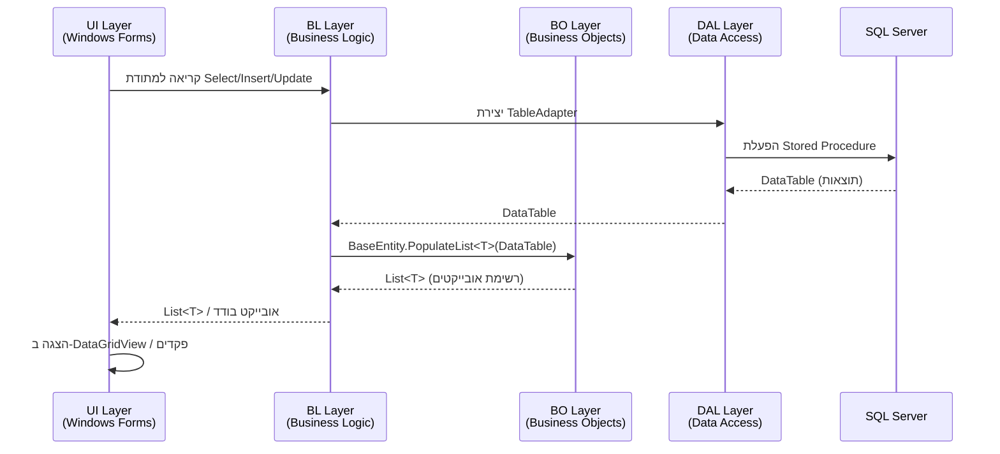
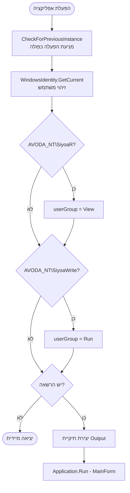
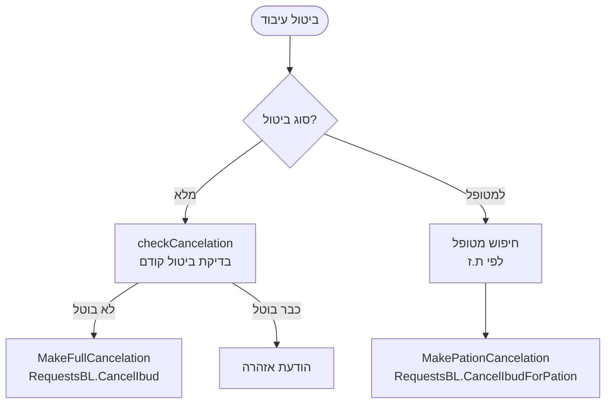
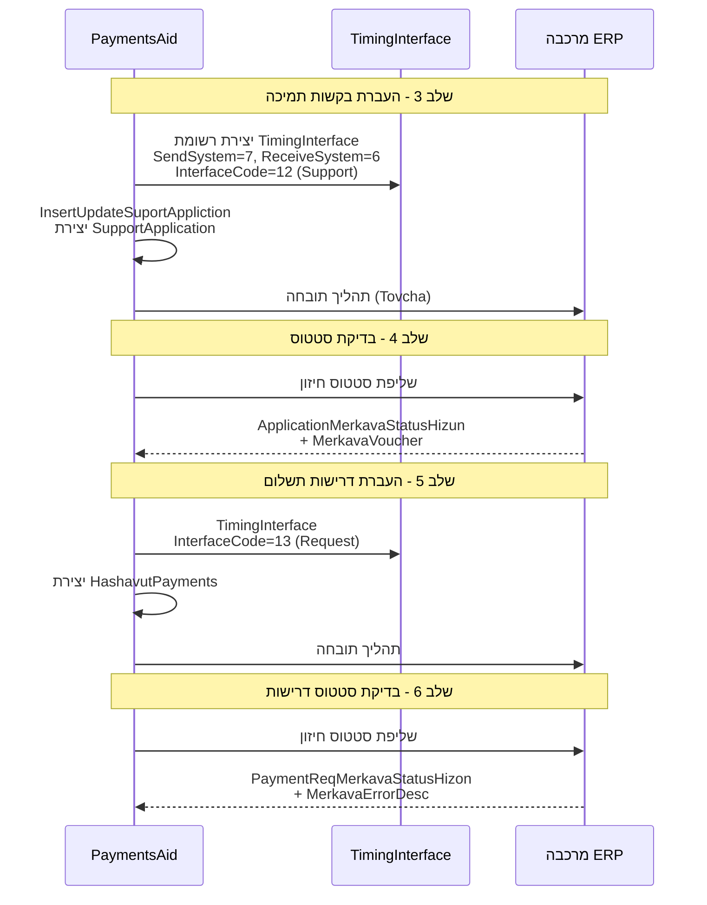
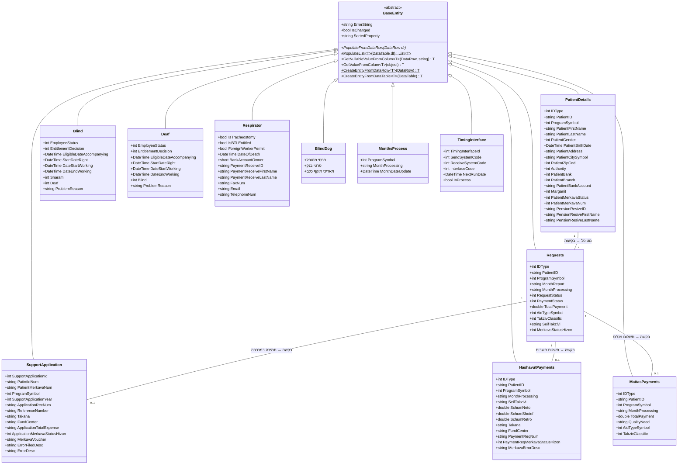
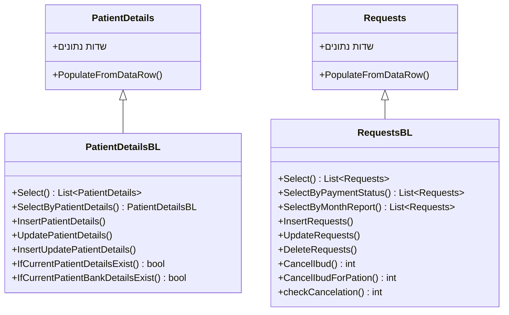
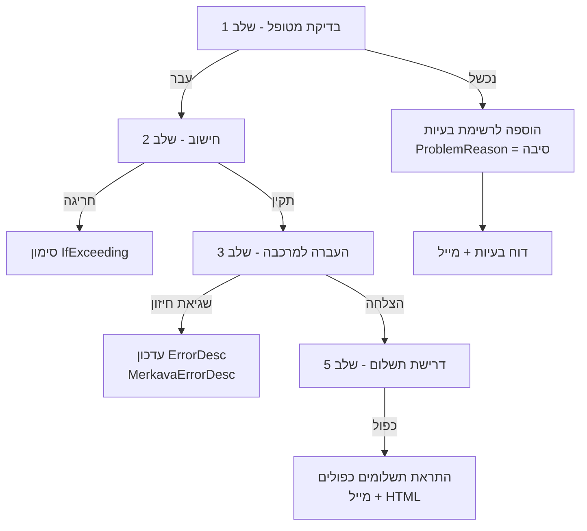

# מסמך עיצוב - תיעוד מערכת PaymentsAid

## סקירה כללית (Overview)

מערכת PaymentsAid היא אפליקציית Windows Forms בשפת C# (.NET Framework 2.0) המנהלת תשלומי סיוע לאוכלוסיות מיוחדות במשרד הרווחה (מוסא). המערכת בנויה בארכיטקטורת 3-Tier קלאסית עם ארבעה פרויקטים נפרדים:

- **PaymentsAid** (UI) - שכבת ממשק המשתמש, `Mosa.PaymentsAid.Win`
- **PaymentsAidBL** (Business Logic) - שכבת הלוגיקה העסקית, `Mosa.PaymentsAid.BL`
- **PaymentsAidBO** (Business Objects) - שכבת האובייקטים העסקיים, `Mosa.PaymentsAid.BO`
- **PaymentsAidDAL** (Data Access Layer) - שכבת גישה לנתונים, `Mosa.PaymentsAid.Dal`

המערכת מטפלת בחמש תוכניות סיוע: עיוורים (5), חירשים (6), מונשמים (7), כלבי נחייה (8), וטלפון לחירשים (9). היא מתממשקת עם מערכות חיצוניות: מרכבה (ERP ממשלתי), חשבות, מט"ס, וחסמות (שירות Web לבדיקת זכאויות).

## ארכיטקטורה (Architecture)

### דיאגרמת שכבות ותלויות

```mermaid
graph TB
    subgraph "שכבת UI - PaymentsAid"
        UI[PaymentsAid<br/>WinExe<br/>Mosa.PaymentsAid.Win]
    end

    subgraph "שכבת לוגיקה עסקית - PaymentsAidBL"
        BL[PaymentsAidBL<br/>Library<br/>Mosa.PaymentsAid.BL]
    end

    subgraph "שכבת אובייקטים עסקיים - PaymentsAidBO"
        BO[PaymentsAidBO<br/>Library<br/>Mosa.PaymentsAid.BO]
    end

    subgraph "שכבת גישה לנתונים - PaymentsAidDAL"
        DAL[PaymentsAidDAL<br/>Library<br/>Mosa.PaymentsAid.Dal]
    end

    subgraph "מערכות חיצוניות"
        DB[(SQL Server<br/>SA_RSA_PAYMENTS_AID)]
        MOSA_DB[(SQL Server<br/>MOSA_GENERAL_DATA)]
        MERKAVA[מרכבה ERP]
        HASAMOT[חסמות Web Service]
        HASHAVUT[חשבות]
        MATTAS[מט"ס]
        AD[Active Directory]
        SSRS[SSRS Report Server]
    end

    UI -->|ProjectReference| BL
    UI -->|ProjectReference| BO
    UI -->|ProjectReference| DAL
    BL -->|ProjectReference| BO
    BL -->|ProjectReference| DAL
    BO -->|ProjectReference| DAL

    DAL -->|Typed DataSet + SP| DB
    UI -->|MosaGeneralData DLLs| MOSA_DB
    UI -->|Tovcha Process| MERKAVA
    UI -->|SOAP Web Service| HASAMOT
    UI -->|Export Files| HASHAVUT
    UI -->|Export Files| MATTAS
    UI -->|WindowsIdentity| AD
    UI -->|ReportViewer| SSRS
```

### דיאגרמת זרימת נתונים בין שכבות



### תבנית ירושה BL ← BO

תבנית ייחודית במערכת: כל מחלקת BL יורשת מהמחלקת BO המתאימה. לדוגמה:

```
PatientDetailsBL : PatientDetails : BaseEntity
RequestsBL : Requests : BaseEntity
BlindBL : Blind : BaseEntity
```

כך מחלקת BL מכילה גם את השדות העסקיים (מ-BO) וגם את הלוגיקה העסקית (Select, Insert, Update, Delete).


### ספריות חיצוניות (DLL References)

שכבת UI מתייחסת לספריות חיצוניות הבאות (מתיקיית `DLL\`):
- **MosaGeneralDataBL/BO/Dal** - נתונים כלליים של מוסא (רשויות, ערים)
- **ActiveReports3** - מנוע דוחות ActiveReports
- **Microsoft.ReportViewer.WinForms/Common/WebForms** - הצגת דוחות SSRS
- **XPCommonControls** - פקדי UI מותאמים (XPTaskBox, XPLinkedLabel)
- **System.DirectoryServices** - אימות Active Directory
- **System.Web.Services** - גישה לשירות Web של חסמות

## רכיבים וממשקים (Components and Interfaces)

### 1. נקודת כניסה - Program.cs



### 2. מסך ראשי - MainForm (MDI Container)

MainForm הוא טופס MDI עם SplitContainer:
- **Panel1 (שמאל)**: פאנל ניווט עם קישורים (XPLinkedLabel)
- **Panel2 (ימין)**: אזור תוכן לטפסי בנים

קישורי ניווט:
| קישור | טופס | הרשאה נדרשת |
|--------|-------|-------------|
| הכנת עיבוד | `RequestForm` | Run בלבד |
| תשלום רטרואקטיבי | `RetroPaymentForm` | View/Run |
| דוחות | `Reports` | View/Run |
| שאילתות | `QueryForm` | View/Run |
| היסטוריית רטרו | `RetroPaymentHistory` | View/Run |
| עדכון תעריפים | `TaarifimForm` | View/Run |

כאשר טופס-בן נפתח, Panel1 מנוטרל. כאשר הטופס נסגר, Panel1 מופעל מחדש.

### 3. טופס עיבוד שוטף - RequestForm

זהו הרכיב המרכזי של המערכת. מבצע עיבוד רב-שלבי:

```mermaid
flowchart TD
    S0[שלב 0: קידום חודש עיבוד<br/>PromotionMonthProcessingStep0]
    S1[שלב 1: בדיקת מטופלים<br/>CheckPatientsForCurrentProcessingStep1]
    S2[שלב 2: ביצוע עיבוד/חישוב<br/>ProcessStep2]
    S3[שלב 3: העברת בקשות תמיכה למרכבה<br/>TransferRequestForMerkavaStep3]
    S4[שלב 4: בדיקת סטטוס בקשות תמיכה<br/>CheckingProcessingRequestsForMonthStep4]
    S5[שלב 5: העברת דרישות תשלום למרכבה<br/>TransferRequireForMerkavaStep5]
    S6[שלב 6: בדיקת סטטוס דרישות תשלום<br/>CheckingProcessingRequireForMonthStep6]
    FILES[ייצוא קבצים: חשבות + מט"ס]

    S0 --> S1
    S1 --> S2
    S2 --> S3
    S3 --> S4
    S4 --> S5
    S5 --> S6
    S6 --> FILES
```

#### שלב 1 - בדיקת מטופלים לפי תוכנית:

| תוכנית | פונקציה | בדיקות עיקריות |
|---------|---------|----------------|
| עיוורים | `CheckPationtForBlind()` | פרטי מטופל, בנק, החלטת זכאות, גיל פנסיה, תעסוקה, חסמות |
| חירשים | `CheckPationtForDeaf()` | פרטי מטופל, בנק, החלטת זכאות, גיל פנסיה, תעסוקה, האם עיוור, חסמות |
| מונשמים | `CheckPationtForRespirator()` | פרטי מטופל, בנק, טרכאוסטומיה, ביטוח לאומי, היתר עובד זר |
| כלבי נחייה | `CheckPationtForDogs()` | פרטי מטופל, בנק, תאריכי תוקף כלב |
| טלפון | `CheckPationtForPhone()` | פרטי מטופל, בנק |

#### שלב 2 - חישוב סכומים:

| תוכנית | פונקציה | סוגי עזרה (PaymentTypeSymbol) |
|---------|---------|-------------------------------|
| עיוורים | `MakeCalculationBlindNew()` | 51-עובד, 52-לא עובד, 53-מינימום, 54-פנסיה |
| חירשים | `MakeCalculationDeafNew()` | 61-עובד, 62-לא עובד, 63-פנסיה עובד, 64-פנסיה לא עובד |
| מונשמים | `MakeCalculationRespirationNew()` | 71-מונשם |
| כלבי נחייה | `MakeCalculationDogBlindNew()` | 81-כלבי נחייה |
| טלפון | `MakeCalculationPhoneBlindNew()` | (לפי תוכנית) |

#### חישוב גיל פנסיה:

```
PensionAge:     גבר=67, אישה=62
OldPensionAge:  גבר=65, אישה=60
PensionAgeBlind: גבר=67, אישה=62
```

### 4. טופס תשלום רטרואקטיבי - RetroPaymentForm

מאפשר תשלום עבור תקופות קודמות למטופל ספציפי:
- חיפוש מטופל לפי סוג זהות + מספר זהות
- בחירת תוכנית סיוע
- בדיקת זכאות מול חסמות
- חישוב סכום (`DoCalculationForBlind()`, `DoCalculationForDeaf()`)
- יצירת בקשת תשלום עם `RequestStatus=2` (רטרואקטיבי)
- בדיקה שהעיבוד השוטף הושלם (`checkIfIbudIsDone()`)

### 5. טופס ביטול עיבוד - CancelIbud



### 6. ממשק מרכבה (Merkava Interface)



### 7. ממשק חסמות (Hasamot Web Service)

- כתובת: `http://adabas/MosaIntegrationWS/Hasamot.asmx`
- מתודה: `CheckEntitlementFromHasamot(Requests request)`
- מחזיר: `HasamaWithMisgeretInfo` - מידע על הסמכה רפואית ומסגרת
- משמש בשלב 1 של העיבוד השוטף ובתשלום רטרואקטיבי

### 8. ייצוא קבצי תשלום

| פונקציה | תוכנית | מערכת יעד | פורמט |
|---------|--------|-----------|-------|
| `ExportFileHashavut()` | עיוורים, כלבי נחייה | חשבות | קובץ טקסט בפורמט קבוע |
| `ExportFileHashavutRespiration()` | מונשמים | חשבות | קובץ טקסט בפורמט קבוע |
| `ExportFileMattasBlind()` | עיוורים | מט"ס | קובץ טקסט בפורמט קבוע |
| `ExportFileMattasDeaf()` | חירשים | מט"ס | קובץ טקסט בפורמט קבוע |

קבצים נשמרים בתיקיית `Output\` שנוצרת אוטומטית בהפעלה.

### 9. מערכת דוחות

- שימוש ב-`Microsoft.ReportViewer.WinForms` להצגת דוחות SSRS
- שרת דוחות מוגדר ב-app.config: `ReportServer`, `ReportPath`
- `GeneralFunc.RenderProblemPatientReport()` - רינדור דוח מטופלים בעייתיים
- `GeneralFunc.SendMailNegativeRequestReport()` - שליחת דוח בקשות שליליות
- `GeneralFunc.SendMailForDoublePayments()` - שליחת התראת תשלומים כפולים בפורמט HTML

### 10. מערכת דואר אלקטרוני - MailHelper

- שליחה באמצעות SMTP (`SmtpClient`)
- כתובת שולח: `MerkavaTovchaUser@molsa.gov.il`
- תמיכה ברינדור דוחות SSRS ל-PDF וצירוף למייל
- שמירת רשומת מייל ב-DB: `MailsBL.InsertMails()`
- שמירת קבצים מצורפים: `MailsAttachmentsBL.InsertUpdateMailsAttachments()`
- כתובות התראה מוגדרות ב-app.config:
  - `MailAdress` - כתובת כללית
  - `DoublePaymentsProgram5And8MailAdress` - תשלומים כפולים עיוורים+כלבים
  - `DoublePaymentsProgram6MailAdress` - תשלומים כפולים חירשים


## מודל נתונים (Data Models)

### דיאגרמת ישויות עסקיות



### תבנית BL - ירושה מ-BO



### Enums מרכזיים (מוגדרים ב-Common.cs)

| Enum | ערכים | תיאור |
|------|-------|-------|
| `ProgramSymbol` | Blind=5, Deaf=6, Respiration=7, Dogs=8, Phone=9 | סמלי תוכניות סיוע |
| `RequestStatus` | CurrentPayment=1, RetroactivePayment=2, AbnormalPayment=3, Unpaid=4, Clean=5, Cancellation=6 | סטטוס בקשה |
| `PaymentStatus` | Wait=1, Passed=2, NotForDataProcessing=3 | סטטוס תשלום |
| `PaymentTypeSymbol` | BlindWorker=51, BlindNotWorker=52, MinTariff=53, OldMan=54, DeafWorker=61, DeafNotWorker=62, OldWorker=63, OldNotWorker=64, Respiration=71, Dogs=81 | סוגי עזרה |
| `UserGroup` | View=1, Run=2 | קבוצות הרשאה |
| `IfExceeding` | ExceedingWaitHarig=0, ExceedingWaitAnala=1, NotExceeding=9 | חריגה תקציבית |
| `MerkavaParameters` | SendSystem=7, ReceiveSystemCode=6, InterfaceCodeSupport=12, InterfaceCodeRequest=13 | פרמטרי מרכבה |

### הגדרות תצורה (app.config)

| מפתח | ערך לדוגמה | תיאור |
|------|-----------|-------|
| Connection String | `SA_RSA_PAYMENTS_AID` | חיבור לבסיס נתונים ראשי |
| Connection String | `MOSA_GENERAL_DATA` | חיבור לנתונים כלליים |
| `ReportServer` | `http://sqlTest/ReportServer` | שרת דוחות SSRS |
| `ReportPath` | `/PaymentsAid/` | נתיב דוחות |
| `PaymentsAid_Hasamot_Hasamot` | `http://adabas/MosaIntegrationWS/Hasamot.asmx` | שירות חסמות |
| `MakeHashavutFile` | `True/False` | האם לייצר קובץ חשבות |
| `MailAdress` | כתובת מייל | כתובת להתראות |
| `DoublePaymentsProgram5And8MailAdress` | כתובות מייל | התראת כפולים עיוורים+כלבים |
| `DoublePaymentsProgram6MailAdress` | כתובות מייל | התראת כפולים חירשים |


## תכונות נכונות (Correctness Properties)

*תכונה (Property) היא מאפיין או התנהגות שצריכים להתקיים בכל הרצה תקינה של המערכת - למעשה, הצהרה פורמלית על מה שהמערכת אמורה לעשות. תכונות משמשות כגשר בין מפרטים קריאים לאדם לבין ערבויות נכונות הניתנות לאימות אוטומטי.*

### Property 1: PopulateList round-trip - מיפוי DataTable לאובייקטים

*לכל* DataTable עם N שורות תקינות, הפעלת `BaseEntity.PopulateList<T>(dt)` צריכה להחזיר רשימה בגודל N, וכל אובייקט ברשימה צריך להכיל את הערכים המתאימים מהשורה המקבילה ב-DataTable.

**Validates: Requirements 2.2, 2.4**

### Property 2: GetNullableValueFromColum - טיפול בערכי null

*לכל* ערך מסוג T ו*לכל* DataRow, אם העמודה מכילה `DBNull.Value` או `null`, אז `GetNullableValueFromColum<T>` צריכה להחזיר `default(T)`. אם העמודה מכילה ערך תקין מסוג T, הפונקציה צריכה להחזיר את הערך עצמו.

**Validates: Requirements 2.3**

### Property 3: ירושת BL מ-BO

*לכל* מחלקת BL בפרויקט PaymentsAidBL, מחלקת הבסיס שלה צריכה להיות המחלקה המקבילה בפרויקט PaymentsAidBO (לדוגמה: `PatientDetailsBL` יורשת מ-`PatientDetails`, `RequestsBL` יורשת מ-`Requests`).

**Validates: Requirements 4.1**

### Property 4: ערכי Enum וקבועים תואמים למפרט

*לכל* ערך enum מוגדר ב-`Common.cs`, הערך המספרי צריך להתאים למפרט: `ProgramSymbol.Blind=5`, `ProgramSymbol.Deaf=6`, `ProgramSymbol.Respiration=7`, `ProgramSymbol.Dogs=8`, `ProgramSymbol.Phone=9`, `MerkavaParameters.SendSystem=7`, `MerkavaParameters.ReceiveSystemCode=6`, `MerkavaParameters.InterfaceCodeSupport=12`, `MerkavaParameters.InterfaceCodeRequest=13`, וכן שאר ערכי ה-enums.

**Validates: Requirements 4.6, 11.2**

### Property 5: פונקציות עיצוב תאריכים

*לכל* תאריך תקין (DateTime), `MakeStr4DateSQL(dt)` צריכה להחזיר מחרוזת בפורמט `'YYYY-MM-DD'`, `MakeStringYYYYMM(s)` צריכה להחזיר מחרוזת בפורמט `'YYYYMM'`, ו-`MakeStr4DateFrom(dt)` צריכה להחזיר מחרוזת בפורמט `'01/MM/YYYY'`.

**Validates: Requirements 4.7**

### Property 6: בדיקת מטופל - נתונים חסרים מכשילים בדיקה

*לכל* תוכנית סיוע ו*לכל* מטופל שחסרים לו פרטים הכרחיים (שם, פרטי בנק, או החלטת זכאות לפי התוכנית), פונקציית הבדיקה (`CheckPationtForBlind`, `CheckPationtForDeaf`, `CheckPationtForRespirator`, `CheckPationtForDogs`) צריכה להחזיר `false` ולהגדיר את שדה `ProblemReason` של המטופל.

**Validates: Requirements 7.4, 7.5, 7.6, 7.7, 12.4, 19.1**

### Property 7: מיפוי PaymentTypeSymbol לפי סטטוס מטופל

*לכל* מטופל עיוור, סוג העזרה (PaymentTypeSymbol) צריך להיקבע באופן דטרמיניסטי: עובד→51, לא עובד→52, מינימום→53, פנסיה→54. *לכל* מטופל חירש: עובד→61, לא עובד→62, פנסיה עובד→63, פנסיה לא עובד→64.

**Validates: Requirements 8.1, 8.2**

### Property 8: חישוב גיל פנסיה

*לכל* תאריך לידה, תאריך דיווח ומין, פונקציית `IfPensioner` צריכה להחזיר 1 אם ורק אם הגיל בתאריך הדיווח עולה על סף הפנסיה (גבר=67, אישה=62), ו-`IfPensionerBlind` צריכה להשתמש בסף הפנסיה לעיוורים (גבר=67, אישה=62).

**Validates: Requirements 8.5, 8.6**

### Property 9: סימון חריגה תקציבית

*לכל* בקשת תשלום, אם סכום התשלום חורג מהתקציב המוקצה, שדה `IfExceeding` צריך להיות 0 (ממתין לחריג) או 1 (ממתין לאנלה), ואם לא חורג - הערך צריך להיות 9.

**Validates: Requirements 8.7**

### Property 10: זיהוי תשלומים כפולים

*לכל* רשימת בקשות תשלום, אם קיימים שני רשומות עם אותו מטופל (IDType + PatientID) ואותו חודש עיבוד בתוכניות שונות, הפונקציה `checkDoublePayment()` צריכה לזהות אותם כתשלומים כפולים.

**Validates: Requirements 8.8**

### Property 11: ייצוא קבצי תשלום - שלמות רשומות

*לכל* רשימת תשלומים תקינה (HashavutPayments או MattasPayments), קובץ הייצוא שנוצר צריך להכיל בדיוק את אותו מספר רשומות כמו ברשימת הקלט, וכל רשומה צריכה להכיל את פרטי המטופל והסכום בפורמט הנכון.

**Validates: Requirements 7.12, 13.1, 13.2, 13.3**

### Property 12: HTML תשלומים כפולים מכיל את כל הפרטים

*לכל* רשימת `DoublePayments`, הפונקציה `getHtml()` צריכה להחזיר מחרוזת HTML שמכילה את פרטי כל המטופלים ברשימה (שם, ת.ז, סכום).

**Validates: Requirements 15.5**

### Property 13: אימות קלט מספרי בלבד

*לכל* תו (char), פונקציית `OnlyNum` צריכה לאשר רק תווים מספריים (0-9) ולדחות כל תו אחר.

**Validates: Requirements 16.5**

### Property 14: חישוב סכום תשלום דטרמיניסטי

*לכל* מטופל עם סוג עזרה ותעריף ידועים, סכום התשלום המחושב צריך להיות שווה לתעריף המוגדר לסוג העזרה שלו, ללא תלות בסדר העיבוד או במטופלים אחרים.

**Validates: Requirements 7.8, 9.5, 9.6**

## טיפול בשגיאות (Error Handling)

### שגיאות ברמת המטופל (עיבוד שוטף)

כאשר מטופל נכשל בבדיקות שלב 1, המערכת:
1. מגדירה את שדה `ProblemReason` באובייקט המטופל (Blind/Deaf/Respirator/BlindDog)
2. מוסיפה את המטופל לרשימת הבעיות המוצגת ב-DataGridView
3. בסיום העיבוד, מייצרת דוח מטופלים בעייתיים (`RenderProblemPatientReport`)
4. שולחת את הדוח במייל לכתובות המוגדרות

### שגיאות מרכבה

- `SupportApplication.ErrorFiledDesc` + `ErrorDesc` - שגיאות בבקשת תמיכה
- `HashavutPayments.MerkavaErrorDesc` - שגיאות בדרישת תשלום
- `PatientDetails.ErrorHizon` - שגיאות חיזון ברמת המטופל
- סטטוס חיזון (`ApplicationMerkavaStatusHizun`, `PaymentReqMerkavaStatusHizon`) מציין הצלחה/כישלון

### שגיאות כלליות

- `BaseEntity.ErrorString` - שדה שגיאה גנרי בכל אובייקט עסקי
- תשלומים כפולים מזוהים ב-`checkDoublePayment()` ונשלחת התראה במייל
- חריגות תקציביות מסומנות ב-`IfExceeding` ומטופלות בנפרד

### זרימת טיפול בשגיאות



## אסטרטגיית בדיקות (Testing Strategy)

### גישה כפולה: בדיקות יחידה + בדיקות מבוססות תכונות

המערכת דורשת שני סוגי בדיקות משלימים:

#### בדיקות יחידה (Unit Tests)
מתמקדות בדוגמאות ספציפיות, מקרי קצה, ותנאי שגיאה:
- אימות מבנה פרויקטים (תלויות, namespaces, OutputType)
- אימות ערכי enum ספציפיים
- אימות הגדרות תצורה (connection strings, URLs)
- אימות מבנה ישויות עסקיות (שדות קיימים)
- מקרי קצה: DataTable ריק, ערכי null, תאריכים לא תקינים

#### בדיקות מבוססות תכונות (Property-Based Tests)
מאמתות תכונות אוניברסליות על פני כל הקלטים:
- ספריית בדיקות: **FsCheck** (עבור C# / .NET)
- מינימום 100 איטרציות לכל בדיקת תכונה
- כל בדיקה מתויגת בהתאם לתכונה במסמך העיצוב

#### תיוג בדיקות תכונה

כל בדיקת תכונה תתויג בפורמט:
```
// Feature: payments-aid-system-documentation, Property {number}: {property_text}
```

#### מיפוי תכונות לבדיקות

| תכונה | סוג בדיקה | תיאור |
|--------|-----------|-------|
| Property 1 | Property Test | PopulateList round-trip |
| Property 2 | Property Test | GetNullableValueFromColum null handling |
| Property 3 | Property Test | BL inherits from BO |
| Property 4 | Property Test | Enum values match spec |
| Property 5 | Property Test | Date formatting functions |
| Property 6 | Property Test | Patient validation - missing data |
| Property 7 | Property Test | PaymentTypeSymbol mapping |
| Property 8 | Property Test | Pension age calculation |
| Property 9 | Property Test | Budget exceeding flag |
| Property 10 | Property Test | Double payment detection |
| Property 11 | Property Test | Export file record completeness |
| Property 12 | Property Test | Double payments HTML content |
| Property 13 | Property Test | Numeric-only validation |
| Property 14 | Property Test | Payment amount determinism |

#### בדיקות יחידה (דוגמאות ומקרי קצה)

| דרישה | סוג בדיקה | תיאור |
|--------|-----------|-------|
| 1.1-1.9 | Unit Test | אימות מבנה פרויקטים ותלויות |
| 2.1, 2.5-2.8 | Unit Test | אימות מבנה ישויות עסקיות |
| 3.3, 3.4, 3.6 | Unit Test | אימות הגדרות DAL |
| 5.2-5.5 | Unit Test | אימות הרשאות משתמש |
| 6.2, 6.5 | Unit Test | אימות מבנה MainForm |
| 8.3, 8.4 | Unit Test | ערכי PaymentTypeSymbol קבועים |
| 11.3, 11.4 | Unit Test | מבנה ישויות ממשק מרכבה |
| 12.1 | Unit Test | כתובת שירות חסמות |
| 18.1-18.6 | Unit Test | מבנה ישויות תוכניות סיוע |
| 20.1-20.5 | Unit Test | הגדרות תצורה |
